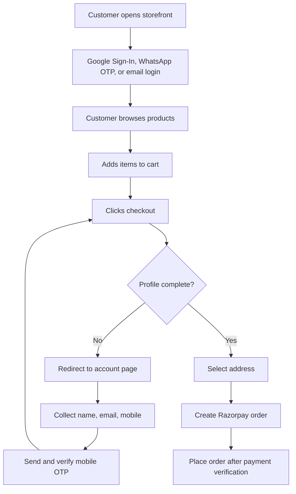

# Customer Module Design

## Google OAuth Client Configuration

Use application type `Web application`.

Authorized JavaScript origins:

- `http://localhost:8080`
- `http://localhost:5173`
- `http://localhost:5176`
- `https://kpskrishnai.com`

Authorized redirect URIs:

- `http://localhost:8080/customer-login`
- `http://localhost:5173/customer-login`
- `http://localhost:5176/customer-login`
- `https://kpskrishnai.com/customer-login`

The current implementation uses Google Identity Services button/popup mode, so JavaScript origins are the critical entries. Redirect URIs are added for future redirect-based login support.

Configured client id:

`647290985970-rhhho15u57fp07jrj75him17gfvjnhc4.apps.googleusercontent.com`

## User Flow

## UI/UX Wireframe

Customer login:

- Google Sign-In button
- WhatsApp OTP login
- Email login / new account
- Existing session card with profile pending state

Account page:

- Profile completion alert
- Full name, email, mobile fields
- Mobile OTP send/verify block
- Address management
- Links to orders and checkout

Checkout:

- Loads customer profile before payment
- Redirects incomplete customers to `/account?redirect=/checkout`
- Blocks payment order creation server-side if profile is incomplete

## Database Schema Additions

`customers` now supports:

- `email`
- `password_hash`
- `auth_provider`
- `google_subject`
- `mobile_verified`
- `email_verified`
- `updated_at`
- `profile_completed_at`

Unique indexes are added for lowercase email and Google subject.

## API Endpoints

Public:

- `POST /api/auth/google`
- `POST /api/auth/register-email`
- `POST /api/auth/login-email`
- `POST /api/auth/send-otp`
- `POST /api/auth/verify-otp`

Customer JWT required:

- `GET /api/customer-profile`
- `PUT /api/customer-profile`
- `POST /api/customer-profile/mobile/verify-otp`
- `POST /api/checkout/payment-order`
- `POST /api/order/place`

## Validation Rules

Checkout/payment is blocked unless all are true:

- full name exists
- email address exists
- mobile number exists
- mobile number is OTP verified

Profile updates reject:

- invalid mobile numbers
- duplicate mobile numbers
- duplicate email addresses
- blank full name, email, or mobile during profile save

## Security Notes

- Google ID tokens are verified on the backend against the configured client id.
- Customer APIs use existing customer JWT authentication.
- Password login stores BCrypt hashes only.
- Mobile changes reset `mobile_verified` until OTP is completed again.
- Checkout and order placement both enforce profile readiness, so API bypass is blocked.
